MATH 154 - HW3
================
Zihao Xu
Septemper 17, 2017

### summary

In this assignment we will work with the packages `tidyr` and `dplyr`. The data for the assignment are given in the packages `nycflights13` (airline flights).

``` r
library(nycflights13)
require(lubridate)
require(ggplot2)
require(mosaic)
require(babynames)
require(dplyr)
require(tidyr)
```

### assignment

1.  For each of the questions below, fix the R chunk so that it can compile and proivde the needed information.

    1.  How many babies are represented?

    ``` r
    babynames %>%
      summarise(total = sum(n)) # a reduction verb
    ```

        ## # A tibble: 1 x 1
        ##       total
        ##       <int>
        ## 1 340851912

    1.  How many babies are there in each year?

    ``` r
      babynames %>% 
          group_by(year) %>% 
          summarise(total = sum(n))
    ```

        ## # A tibble: 136 x 2
        ##     year  total
        ##    <dbl>  <int>
        ##  1  1880 201482
        ##  2  1881 192696
        ##  3  1882 221534
        ##  4  1883 216945
        ##  5  1884 243463
        ##  6  1885 240854
        ##  7  1886 255319
        ##  8  1887 247396
        ##  9  1888 299474
        ## 10  1889 288948
        ## # ... with 126 more rows

    1.  How many distinct names in each year?

    ``` r
      babynames %>%
          group_by(year) %>%
          summarise(name_count = n_distinct(name))
    ```

        ## # A tibble: 136 x 2
        ##     year name_count
        ##    <dbl>      <int>
        ##  1  1880       1889
        ##  2  1881       1830
        ##  3  1882       2012
        ##  4  1883       1962
        ##  5  1884       2158
        ##  6  1885       2139
        ##  7  1886       2225
        ##  8  1887       2215
        ##  9  1888       2454
        ## 10  1889       2390
        ## # ... with 126 more rows

    1.  How many distinct names of each sex in each year?

    ``` r
      babynames %>%
          group_by(sex, year) %>%
          summarise(distinct_name_count = n_distinct(name)) %>%
          arrange(year)
    ```

        ## # A tibble: 272 x 3
        ## # Groups:   sex [2]
        ##      sex  year distinct_name_count
        ##    <chr> <dbl>               <int>
        ##  1     F  1880                 942
        ##  2     M  1880                1058
        ##  3     F  1881                 938
        ##  4     M  1881                 997
        ##  5     F  1882                1028
        ##  6     M  1882                1099
        ##  7     F  1883                1054
        ##  8     M  1883                1030
        ##  9     F  1884                1172
        ## 10     M  1884                1125
        ## # ... with 262 more rows

    1.  Graphically summarize the previous two commands (two separate plots), because they are too long to look at as a table.

    ``` r
      babynames %>%
          group_by(year) %>%
          summarise(name_count = n_distinct(name))%>%
          ggplot(aes(x = year, y = name_count)) +
          geom_line() + 
          labs(x = "Year", y = "Number of distinct names", title = "Trend of number of distinct names")
    ```

    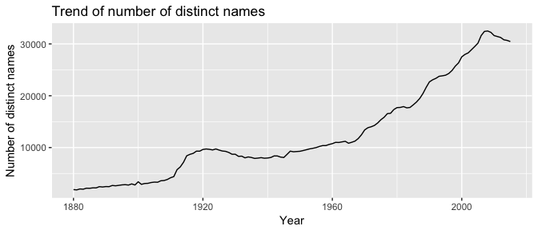

    ``` r
      babynames %>%
          group_by(sex, year) %>%
          summarise(name_count = n_distinct(name)) %>%
          ggplot(aes(x = year, y = name_count)) +
          geom_line(aes(color = sex)) + 
          labs(x = "Year", y = "Number of distinct names", title = "Trend of number of distinct names by sex")
    ```

    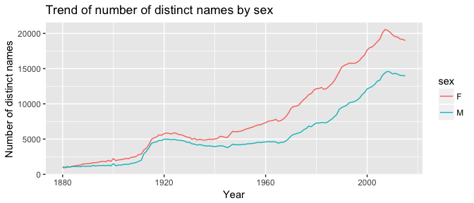

    1.  Pick out a name (or names) of interest to you. Plot out its popularity over time.

    ``` r
      babynames %>%
          filter(name == 'Mary' & n != 0) %>%
          group_by(year) %>%
          summarize(num_mary = sum(n)) %>%
          ggplot(aes(x = year, y = num_mary)) +
          geom_line()+
          labs(x = "Year", y = "Number of occurence", title = "Trend for the name Mary")
    ```

    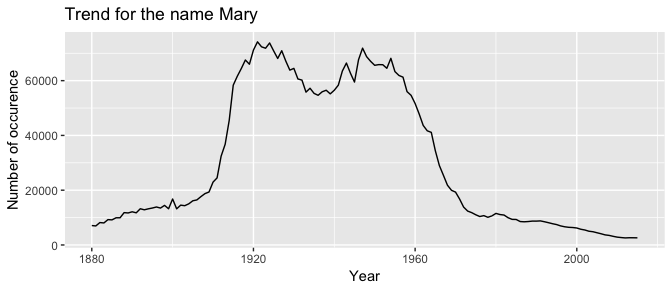

2.  MDS 4.3: Use the `nycflights13` package and the `flights` dataframe to answer the following questions: what plane (specified by the `tailnum` variable) traveled the most times to New York City airports in 2013 (note the entire dataset is to NYC, so you don't need to filter on "to NYC")? Plot the number of trips per week over the year (for that plane).

    ``` r
      flights %>%
          filter(!is.na(tailnum)) %>%
          group_by(tailnum) %>%
          summarise(times_to_nyc = n()) %>%
          arrange(desc(times_to_nyc)) %>%
          head(1)
    ```

        ## # A tibble: 1 x 2
        ##   tailnum times_to_nyc
        ##     <chr>        <int>
        ## 1  N725MQ          575

    ``` r
      flights%>%
          filter(tailnum == 'N725MQ') %>%
          mutate(date = ymd(sprintf('%04d%02d%02d', year, month, day))) %>%
          mutate(week_num = week(date)) %>%
          group_by(week_num) %>%
          summarize(flight_num = n()) %>%
          ggplot(aes(x = week_num, y = flight_num)) +
          geom_point(color = "red", size = 3) +
          geom_line() +
          labs(x = "Week of the year", y = "Counts", title = "Trips per week of N725MQ in 2013 to NYC")
    ```

    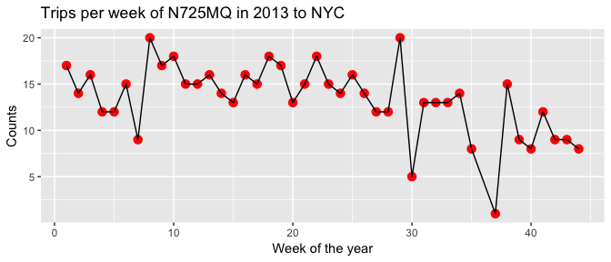

3.  MDS 4.4: Use the `nycflights13` package and the `flights` and `planes` tables to answer the following questions:

    1.  What is the oldest plane (specified by the tailnum variable) that flew to New York City airports in 2013?

    ``` r
      planes %>%
          rename(year_built = year) %>%
          right_join(flights, by = "tailnum") %>%
          arrange(year_built) %>%
          select(tailnum, year_built) %>%
          head(1) 
    ```

        ## # A tibble: 1 x 2
        ##   tailnum year_built
        ##     <chr>      <int>
        ## 1  N381AA       1956

    1.  How many airplanes (that flew to New York City) are included in the planes table? How many have missing date of manufacture?

    ``` r
      flights%>%
          group_by(tailnum) %>%
          slice(1L) %>%
          inner_join(planes, by = "tailnum")%>%
          ungroup() %>%
          summarize(num_included = n(), missing_date = sum(is.na(year.y)))
    ```

        ## # A tibble: 1 x 2
        ##   num_included missing_date
        ##          <int>        <int>
        ## 1         3322           70

    1.  Display and interpret the distribution of the date of manufacture.

    ``` r
        planes%>%
            ggplot(aes(year)) +
            geom_histogram() +
            labs(title = "Distribution of year of manufacture.")
    ```

    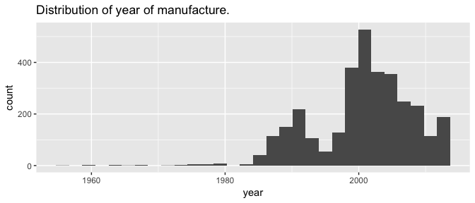 Interpretation: Most of the manufacture times are centered around 2000, while there is also another smaller peak at around 1990. The distribution overall is skewed to the left. Some of the extreme values ranges from 1957 to 1980. The trough at around 1993 might be due to the recession of the 1990s, while the upward trend at around 2000 is due to the General Aviation Revitalization Act passed in 1994.

    1.  Consider the following manufacturers: AIRBUS, AIRBUS INDUSTRIE, BOEING, BOMBARDIER INC, EMBRAER, MCDONNELL DOUGLAS, MCDONNELL DOUGLAS AIRCRAFT CO, MCDONNELL DOUGLAS CORPORATION (the most common manufacturers). Characterize and interpret the distribution of manufacturer. Has the distribution of manufacturer changed over time as reflected by the airplanes flying to NYC in 2013? \[Provide a plot and a table.\]

    ``` r
    # here is some code you could use, but there are many other ways to consolodate the information.
    planes2 <- planes %>% 
      filter(manufacturer %in% c("AIRBUS", "AIRBUS INDUSTRIE", "BOEING", 
                             "BOMBARDIER INC", "EMBRAER", "MCDONNELL DOUGLAS", 
                             "MCDONNELL DOUGLAS AIRCRAFT CO", 
                             "MCDONNELL DOUGLAS CORPORATION")) %>%
      mutate(manufact2 = ifelse(substr(manufacturer,1,5)=="MCDON", "MCDONNELL DOUGLAS", 
                            ifelse(substr(manufacturer,1,5) == "AIRBU", "AIRBUS", 
                                   manufacturer)))  %>%
      mutate(year2 = factor(cut(year, breaks=seq(from=1960, to=2015, by=5))))

    flights %>%
      left_join(planes2, by = "tailnum") %>%
      select(year2, manufact2)%>%
      filter((!is.na(year2)) & (!is.na(manufact2))) %>%
      mutate(count = 1) %>%
      aggregate(count~., ., FUN=sum) %>%
      spread(key = manufact2, value = count) %>%
      arrange(year2)
    ```

        ##          year2 AIRBUS BOEING BOMBARDIER INC EMBRAER MCDONNELL DOUGLAS
        ## 1  (1960,1965]     NA      4             NA      NA                NA
        ## 2  (1970,1975]     NA     NA             NA      NA                 5
        ## 3  (1975,1980]     NA     NA             NA      NA                86
        ## 4  (1980,1985]     NA    971             NA      NA                NA
        ## 5  (1985,1990]    532   8765             NA      NA              8371
        ## 6  (1990,1995]   6457   8924             NA      NA              5687
        ## 7  (1995,2000]  21843  29309           1152   12815                32
        ## 8  (2000,2005]  33791  16972          14865   30114                NA
        ## 9  (2005,2010]  16731  11651          11201   16855                NA
        ## 10 (2010,2015]   7631   4944            411    4656                NA

    ``` r
    flights %>%
      inner_join(planes2, by = "tailnum") %>%
      select(year2, manufact2)%>%
      arrange(year2) %>%
      mutate(count = 1) %>%
      filter(!is.na(year2))%>%
      ggplot(aes(x = year2, y = count, fill = manufact2)) +
      geom_bar(stat = "identity") +
      labs(x = "year", y = "count", title = "Distribution of airlines over time") +
      theme(axis.text.x = element_text(angle = 90, hjust = 1))
    ```

    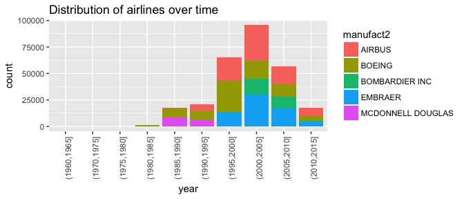

    ``` r
    flights %>%
      inner_join(planes2, by = "tailnum") %>%
      select(year2, manufact2)%>%
      arrange(year2) %>%
      mutate(count = 1) %>%
      filter(!is.na(year2))%>%
      ggplot(aes(x = year2, y = count, fill = manufact2)) +
      geom_bar(stat = "identity", position = position_fill()) +
      labs(x = "year", y = "percent", title = "Percent distribution of airlines over time")+
      theme(axis.text.x = element_text(angle = 90, hjust = 1))
    ```

    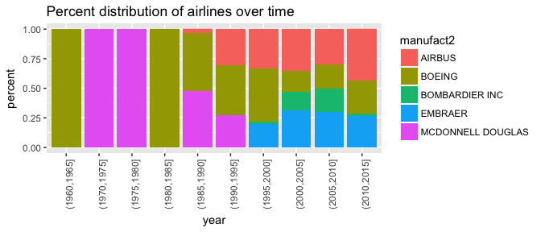 From the plots above, we can clearly see that Boeing and McDonnell Douglas used to be the dominant players but over time, their market share are shrinking as Embraer, AirBus and Bombardier are entering. Among the three new comers, we can see a increaing share being concurred by AirBus and Embraer (roughly), while Bombardier peaked at 2005 - 2010 and then declined.

    1.  Using the same manufacturers as above, provide a graphical representation to display the arrival delays broken down by manufacturer (hint: this probably isn't a line or point geom). \[note: it probably isn't the manufacturer causing arrival delays...\]

    ``` r
        flights %>%
            inner_join(planes2, by = "tailnum") %>%
            group_by(month, manufact2) %>%
            filter(!is.na(arr_delay)) %>%
            summarise(total_delay = sum(arr_delay)) %>%
            ggplot(aes(x = month, y = total_delay, fill = manufact2)) +
            geom_bar(stat = "identity") +
            labs(x = "Month", y = "Total Delay Time", title = "Delay Time Breakdown by Airlines per Month")
    ```

    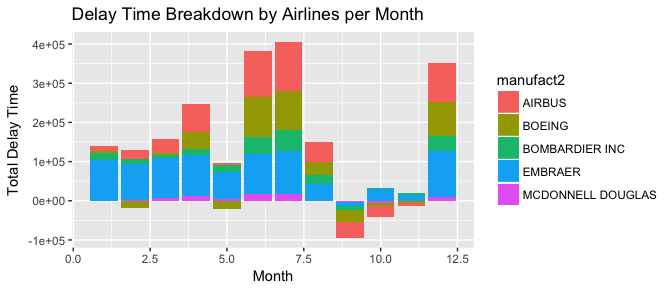

4.  MDS 4.6: Use the `nycflights13` package and the `weather` table to answer the following questions:

    1.  What is the distribution of temperature in July, 2013? \[Provide a plot.\]

    ``` r
        weather %>%
          filter(month == 7) %>%
          ggplot(aes(x = temp)) +
          geom_histogram() +
          labs(x = "Temperature", y = "Counts", title = "Distribution of temperature in July, 2013")
    ```

    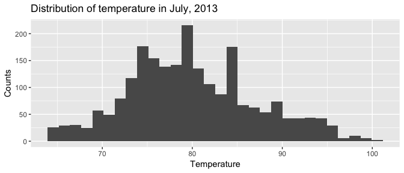

    1.  Identify any important outliers in terms of the wind speed variable. The following observations are outliers defined as those whose wind\_speed values are 3 IQR above the third quartile (all of them are of this case) or below the first quartile (none). Notice that there is a single outlier, the first observation, that has abnormal wind\_speed. This might be due to input error.

    ``` r
        quartile <- quantile(weather$wind_speed, na.rm = TRUE)
        IQR <- as.numeric(quartile[4]) - as.numeric(quartile[2])
        weather%>%
          filter((wind_speed >= as.numeric(quartile[4]) + 3*IQR) | (wind_speed <= as.numeric(quartile[2]) - 3*IQR)) %>%
          arrange(desc(wind_speed))
    ```

        ## # A tibble: 20 x 15
        ##    origin  year month   day  hour  temp  dewp humid wind_dir wind_speed
        ##     <chr> <dbl> <dbl> <int> <int> <dbl> <dbl> <dbl>    <dbl>      <dbl>
        ##  1    EWR  2013     2    12     8 39.02 26.96 61.63      260 1048.36058
        ##  2    JFK  2013     1    31     9 53.60 51.80 93.60      200   42.57886
        ##  3    EWR  2013     1    31     9 60.80 59.00 93.79      230   40.27730
        ##  4    LGA  2013     1    31     9 57.20 53.60 87.74      180   40.27730
        ##  5    EWR  2013     1    31    13 46.04 30.02 53.33      270   39.12652
        ##  6    JFK  2013     1    31    12 51.80 46.40 81.74      270   36.82496
        ##  7    JFK  2013    11    24    15 28.04 -0.04 29.16      310   36.82496
        ##  8    JFK  2013     1    31     6 53.06 51.08 92.96      180   35.67418
        ##  9    JFK  2013     1    31    13 46.94 30.02 51.55      270   35.67418
        ## 10    JFK  2013     1    31    19 42.98 17.06 34.81      260   35.67418
        ## 11    JFK  2013    11    27     9 60.98 59.00 93.19      170   35.67418
        ## 12    LGA  2013     1    31     8 55.40 53.60 93.65      180   35.67418
        ## 13    LGA  2013     3     6    16 41.00 33.98 75.88       70   35.67418
        ## 14    EWR  2013     6    25    20 89.60 66.20 46.14      270   34.52340
        ## 15    JFK  2013     1    31    22 35.96 17.06 45.76      260   34.52340
        ## 16    JFK  2013     2    27    12 48.20 44.60 87.28       90   34.52340
        ## 17    JFK  2013    11    24    16 28.94  1.94 30.82      300   34.52340
        ## 18    LGA  2013     1    31    16 46.04 17.06 30.97      270   34.52340
        ## 19    LGA  2013     2    18     2 19.04  1.94 46.64      310   34.52340
        ## 20    LGA  2013     3     6    17 42.08 30.02 62.04       60   34.52340
        ## # ... with 5 more variables: wind_gust <dbl>, precip <dbl>,
        ## #   pressure <dbl>, visib <dbl>, time_hour <dttm>

    1.  What is the relationship between dewp and humid? \[Provide a plot and comment.\]

    ``` r
        weather%>%
          ggplot(aes(x = dewp, y = humid)) +
          geom_point(size = 1) +
          geom_smooth() +
          labs(title = "Relationship between humid and dewp")
    ```

    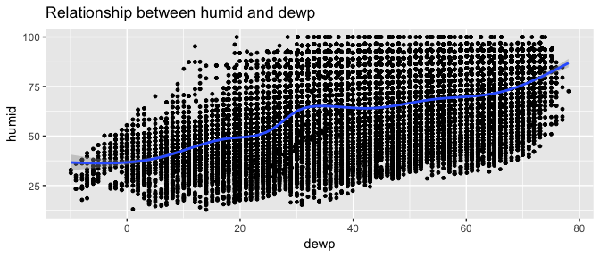 Discussion: as we can see from the graph, there exists a positive relationship between dewp and humid variables. This is to say that, as dewp goes up, humid tends to go up too.

    1.  What is the relationship between precip and visib? \[Provide a plot and comment.\]

    ``` r
        weather%>%
          ggplot(aes(x = precip, y = visib)) +
          geom_point(size = 1) +
          geom_smooth() +
          labs(title = "Relationship between precip and visib")
    ```

    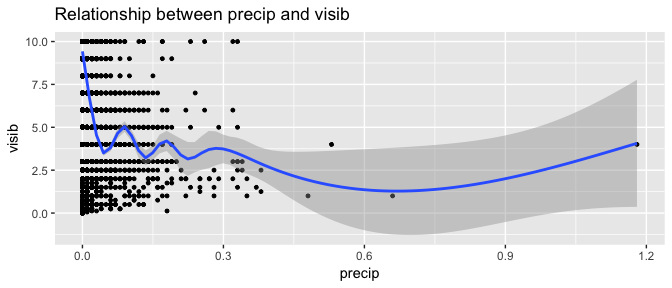 Discussion: as we can see from the graph, there exists a general negative relationship between precip and visib variables. This is to say that, as precip goes up, humid tends to go down, though there exists fluctuations at lower values of precip.
